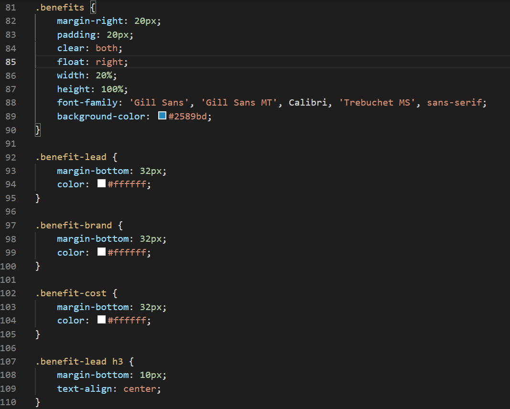

# Refactoring

This projects aim was to take an excisting codebase and refactor it to improve the SEO.

## Changes

Reordered and consolidated CSS code to optimize page loading.
Adjusted html to reflect changes in CSS while adding additional semantic elements, checking on code to make sure links work.

